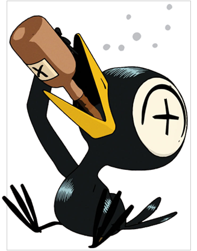
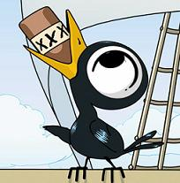

[Back to articles list](../README.md)

# First Experiments with Virtual Player States in [DQRDAP](../2020-07-06%20Post%20Music/README.md)

### _Getting virtual rock musicians drunk_

_Well, if There's one state of mind that most modern rock musicians share it's being drunk, since half the time we're playing, we're actually just working for someone else trying to sell more booze for them. One of the few industries that gets paid in liquor. It's not so much that alcohol is a depressant... it's the state of the world._

* * *

## The Results

Let's just skip straight to the results of this experiment. I would consider this a success. It absolutely sounds like me playing as I get progressively lit.

Let's have a listen and then dig into the theory and methodology below.

**All three of the files below are using THE SAME UNEDITED MIDI FILE. The only thing that was adjusted was the drunk module. and "How much liquor and burritos was fed to Virtual Brent."**

### 1 Brent with his guitar and pedal board playing the MIDI file

<audio controls src="media/1%20Brent%20with%20his%20rig.mp3">
  Unfortunately this site doesn't allow embeeded mp3s, scroll down to the bottom of the page for a list of direct mp3 downloads
</audio>

### 2 Brent with his guitar and pedal board playing the MIDI file after 9 beers

<audio controls src="media/2%20Brent%20wasted%20%289%20beers%29with%20his%20rig.mp3">
  Unfortunately this site doesn't allow embeeded mp3s, scroll down to the bottom of the page for a list of direct mp3 downloads
</audio>

### 3 Brent with his guitar and pedal board playing the MIDI file after 9.5 beers, 5 whiskeys and a burrito

<audio controls src="media/3%20Brent%20wasted%20%289.5%20beers%2C%205%20whiskeys%20and%20a%20burrito%29with%20his%20rig.mp3">
  Unfortunately this site doesn't allow embeeded mp3s, scroll down to the bottom of the page for a list of direct mp3 downloads
</audio>

There's even all these wonderful unexpected things like drunkenly hitting open strings and sliding my fingers recklessly up and down the strings. That's absolutely something I do proportionally to how much I have been drinking.

## Tools for the job

There are three rack containers in Ableton

-   **Instrument Racks** - These group audio together. samples or tone generators
-   **Audio Effects Rack** - These group audio filter effects together
-   **MIDI Effects Rack** - these manipulate MIDI data

## Creating a very loose Person module for @BrentonHoliday

I've created:

-   **MIDI Effects** Rack for a Person Model that will represent Brenton
-   **MIDI effects** rack called drunk that interacts with the Brenton Holiday MIDI Rack
-   **Audio Effects Rack** for his standard electric guitar pedal board
-   **Instrument Rack** that will be is Fender Jaguar modeled and modified from the stock Ableton Electric Guitar.

### Types of MIDI Modules

##### There are two types of MIDI Modules in Post Music

-   **Pre / Performance** - Used while you're tracking or in some way directly interacting with Ableton.
    -   _example: a velocity module that you used to compensate for your controller while you're tracking MIDI_
-   **Post / Playback** - Used while your playing back already tracked MIDI
    -   _example: a velocity module that you used to add human feel after you've tracked the MIDI_

Audio and Effects racks can be used for either purpose.

## How the drunk rack interacts with the player modules

For more information please reference the [Quantum Russian Dolls Paper](../2020-07-06%20Post%20Music/README.md)

### Drunk modules

These are a set of variable MIDI effects that can be attached to player performance modules. A parallel Module to Person . They will influence the parameters of player modules. By Changing the player modules variables in relation to their normal (sober) values.

-   Virtual people are only used for playback, even though it's a type of performance or can be used while performing. You can't compose into people.

#### Drunk Brent Illustration

-   Drunk Module
-   Brent
    -   Brents Brain (controller)
    -   Brents Instrument
        -   Instrument Controller
        -   Instrument
            -   Instrument Basis or samples
        -   Instrument FX or amp

#### Can you get your instrument drunk?

Despite instruments being made of varying qualities of interaction and value. It doesn't contain the correct hookable receptors to get drunk. First off a guitar is an Instruments Rack not a MIDI rack and Spaces can be a huge array shitty qualities but they can't get drunk. Also because they are Effects racks. Drunk effects accuracy of velocity, note, length. The things that happen when instrument get played or are controlled by MIDI.

## WTF is the point of this?

Stay tuned for next week :)

## Downloads & Symlinked Media

### Audio Exports

-   [mp3 - Brent with his guitar and pedal board playing the MIDI file](media/1%20Brent%20with%20his%20rig.mp3)
-   [mp3 - Brent with his guitar and pedal board playing the MIDI file after 9 beers](media/2%20Brent%20wasted%20%289%20beers%29with%20his%20rig.mp3)
-   [mp3 - Brent with his guitar and pedal board playing the MIDI file after 9.5 beers, 5 whiskeys and a burrito](media/3%20Brent%20wasted%20%289.5%20beers%2C%205%20whiskeys%20and%20a%20burrito%29with%20his%20rig.mp3)

### The MIDI File in Question

-   [MIDI File Download](media/BrentsGuitarTrack.mid)

### Modules

-   [Drunk Module 1.0 - MIDI Rack Module](media/Drunk.adg)
-   [BrentonHoliday Module - MIDI Rack Module](media/Brenton%20Holiday.adg)
-   [Brent's Guitar Module - Instrument Rack Module](media/Brent%27s%2065%20Fender%20Jaguar%201.0.adg)
-   [Brent's Pedalboard Module - Effects Rack Module](media/Brent%27s%20Echo%20Board%201.1.adg)

* * *

 
